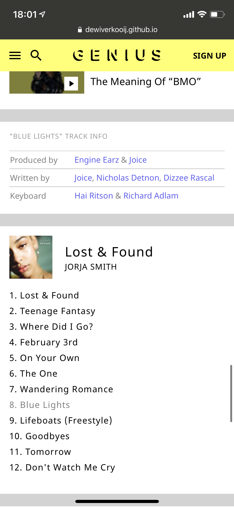

# Procesverslag
**Auteur:** Dewi Verkooij

Markdown cheat cheet: [Hulp bij het schrijven van Markdown](https://github.com/adam-p/markdown-here/wiki/Markdown-Cheatsheet). Nb. de standaardstructuur en de spartaanse opmaak zijn helemaal prima. Het gaat om de inhoud van je procesverslag. Besteedt de tijd voor pracht en praal aan je website.

## Bronnenlijst
1. https://www.w3schools.com/html/html_tables.asp
2. https://css-tricks.com/snippets/css/a-guide-to-flexbox/
3. https://stackoverflow.com/questions/8824831/make-div-stay-at-bottom-of-pages-content-all-the-time-even-when-there-are-scrol
4. https://developer.mozilla.org/en-US/docs/Web/HTML/Element/nav
5. https://stackoverflow.com/questions/2610497/change-an-html5-inputs-placeholder-color-with-css

## Huiswerkopdrachten
Typografie: https://codepen.io/dewi-verkooij/pen/XWKyQVw  
Positioneren 1: https://codepen.io/dewi-verkooij/pen/gOMqovM  
Positioneren 2: https://codepen.io/dewi-verkooij/pen/KKMJQpx  
Flexbox 1: https://codepen.io/dewi-verkooij/pen/RwROvWN?editors=1100  
Flexbox 2: https://codepen.io/dewi-verkooij/pen/PozvzjR?editors=1100  
JS 3-stap 1: https://codepen.io/dewi-verkooij/pen/xxOvgXv  
JS 3-stap 2: https://codepen.io/dewi-verkooij/pen/WNxVpgq  
Grid 1: https://codepen.io/dewi-verkooij/pen/WNGbobY?editors=1100  
Grid 2: https://codepen.io/dewi-verkooij/pen/YzGPpEY?editors=1100  

## Toegankelijkheid

Om te testen of de toegankelijkheid van de website goed is, heb ik een aantal dingen gedaan. Als eerste heb ik een screenreader op mijn laptop aangezet. Ik vond het erg grappig om een keer te zien hoe zoiets werkt. Het lijkt me wel heel lastig om afhankelijk te zijn van een screenreader, want ik kan het zelf echt totaal niet volgen. De bevindingen die ik gedaan heb zijn:

- Het is heel belangrijk om alt teksten toe te voegen aan je afbeeldingen, want de screenreader leest deze voor en het is voor blinden de enige manier om te weten wat er op een afbeelding te zien is. 
- Als je een tabel of een lijst maakt ziet de screenreader dit ook echt als een tabel of een lijst. Hij leest in een lijst bijvoorbeeld eerst voor hoeveel items de lijst heeft, en ook bij elk punt geeft hij aan dat hij bv bij punt 4 van de 12 is. Dit is heel overzichtelijk. In een tabel werkt dit op ongeveer dezelfde manier.
- Als je een input veld hebt, vertelt de screenreader ook aan jou dat je iets kan typen en welke toetsen je moet indrukken om het in te sturen. Dit werkt handig.
- Ik vind over het algemeen niet dat een screenreader duidelijk is. Als ik blind zou zijn zou ik geen idee hebben waar ik was, waar ik heen moest enz. Ik denk dat het handiger is als je als web ontwikkelaar echt kan aangeven welke delen ook relevant zijn voor blinde mensen, zodat alle onduidelijkheden eruit gefilterd worden. Nu leest de screenreader namelijk ook namen van iconen voor en de tekst die daar naast staat, maar als blind persoon ga je dit nooit begrijpen.

Ik heb ook getest of alles bediend kon worden met de tab toets. Bij de elementen waar dit nog niet mogelijk was heb ik tabindex="0" toegevoegd in de html. Hij maakt dan zelf een logische volgorde van de tabs. Als je de volgorde wil beïnvloeden kan je andere getallen invullen en zo zelf een volgorde creeëren.

Met de screenreader kwam ik erachter dat sommige afbeeldingen nog geen alt teksten hadden, deze heb ik toegevoegd. 

## Eindgesprek (week 7/8)

Uiteindelijk voel ik me nu steeds meer vertrouwd met html en css. Javascript blijft lastig, maar is toch ook goed gekomen. Ik ben heel blij met het resultaat dat ik heb kunnen opleveren, maar ook heel blij dat ik er nu weer even vanaf ben ;). 

**Screenshot(s):**

-screenshot(s) van je eindresultaat-

## Voortgang 3 (week 6)

### Stand van zaken

Ik begin eindelijk weer een beetje met plezier aan dit vak. Het eind is in zicht en dat vind ik fijn. Ik ben heel blij met hoe ik de website uiteindelijk gemaakt heb. Ik moet nog een aantal dingen aanpassen, bijvoorbeeld verschillende foto's en teksten waar ik nu steeds dezelfde gebruik. Ook moet ik nog een aantal hover dingen maken. Ten slotte moet ik de surface plane gaan uitwerken. De elementen die ik ga uitwerken zijn: hamburgermenu, zoek functie, duimpjes, roze titels in en uit klappen en show more reacties. Dit is goedgekeurd door Janno. 

**Screenshot(s):**

-screenshot(s) van hoe ver je bent met korte uitleg-

De hele website is nu dus af, wat HTML en CSS betreft. Ik ga vanaf volgende week beginnen met de Javascript en nog wat puntjes op de i zetten. 

### Agenda voor meeting

-samen met je groepje opstellen-

| Noa Bos            | Daan              | Inez             | Niels          | Dewi                   |
| ---                | ---               | ---              | ---            | ---                    |
| Hoe zet ik iets in | Feedback readme en| Hoe maak je een  |                | Ik wil weten wat er    |
| mijn dropdown van  | voorbeeldverslag  | goed hamburger   |                | fout gaat met de marges|
| mijn searchbalk?   | screenreader      | menu?            |                | in mijn carrousel      |

### Verslag van meeting

Er was iets fout gegaan met de margin en padding, de carroussel ziet er nu goed uit dus daar ben ik blij mee. Ik moet nu aan de bak met mijn animaties en de toegankelijkheid van de website. 

## Voortgang 2 (week 5)

### Stand van zaken

Ik had verwacht dat ik veel sneller klaar zou zijn. Ik heb dan ook niet mijn doel behaald. Eigenlijk wilde ik nu allebei de pagina's af hebben, maar helaas is alleen 1 pagina echt af. Ik ben overigens wel heel trots op hoe de pagina geworden is. Ik wil hier wel even een klein feedback puntje achterlaten: in het begin toen we een website moesten kiezen wist ik niet goed hoe ik moest kiezen, achteraf denk ik dat ik, voor mijn doen, een veel te lastige website heb gekozen. 

**Screenshot(s):**

-screenshot(s) van hoe ver je bent met korte uitleg-

Op dit gedeelte ben ik het meest trots, omdat het bijna 1 op 1 hetzelfde is als de website
van Genius. Vooral de tabel die ik gemaakt heb was lastig en de footer. Wat betreft de andere pagina heb ik alleen nog de HTML gemaakt. Dit omdat ik niet had ingeschat dat alles zo lang zou duren.

### Agenda voor meeting

-samen met je groepje opstellen-

| Noa Bos            | Daan              | Inez             | Niels          | Dewi            |
| ---                | ---               | ---              | ---            | ---             |
| Hoe banner anders  | Hoeveel comments  | Hoe zorg je dat  |                | Hoeveel anima-  |
| met hover tekst op | moet je ongeveer  | site op meerdere |                | ties moet ik    |
| mobiel en desktop  | in je code hebben | telefoons werkt  |                | ongeveer maken  |

### Verslag van meeting

Het antwoord op mijn vraag is dat je niet zo zeer een aantal kan geven. Je kan als richtlijn nemen dat je 5 kleine animaties maakt of 3 grote. Ik zorg dat ik maandag laat zien welke animaties ik denk te gaan maken en dan kan Janno beoordelen of het genoeg is of dat ik meer of minder animaties moet maken. 

## Voortgang 1 (week 3)

### Stand van zaken

-dit ging goed & dit was lastig-

Ik had verwacht dat het me iets makkelijker af zou gaan. De website zag er niet heel ingewikkeld uit,
maar ik merk dat ik er toch aardig wat moeite mee heb en ik er veel langer mee bezig ben dan gedacht. 
Wel ben ik heel blij met wat ik tot nu toe heb, omdat het bijna niet te zien is wat mijn website is 
en wat de echte Genius website is. 

**Screenshot(s):**

-screenshot(s) van hoe ver je bent met korte uitleg-

Op dit gedeelte ben ik het meest trots, omdat het bijna 1 op 1 hetzelfde is als de website
van Genius. De achtergrond was even lastig met de gradient, en ook het uitlijnen van alle
losse elementen kostte even wat tijd. 

### Agenda voor meeting

-samen met je groepje opstellen-

| Noa Bos            | Daan              | Inez             | Niels          | Dewi            |
| ---                | ---               | ---              | ---            | ---             |
| Moet ik nog search | Animatie laten    | Hoe maak je de   | Hoe laat je een| Mag je dingen   |
| bar, tweede pagina,| triggeren als het | header responsive| element bewegen| aanpassen? (bv  |
| navigatie icons    | element verschijnt| (heel anders)?   | als je scrollt?| header fixed)   |

### Verslag van meeting

Als je kan uitleggen waarom je bepaalde dingen aanpast, mag het. Zo mag ik dus de header sticky maken als ik vind dat dit beter is. Ik mag een class geven aan de groene en grijze tekst in de lyrics, als ik dit verder maar niet te vaak doe, alleen op de momenten dat het echt duidelijk veel handiger is. 

## Breakdownschets (week 1)

-uitwerken voor de 1e werkgroep - eind van de eerste week-

## Intake (week 1)
-uitwerken voor de kick-off werkgroep - begin van de eerste week-

**Je startniveau:** blauw

**Je focus:** surface plane

**Je opdracht:** Ik ga de website van Genius namaken.

https://genius.com

**Screenshot(s) van de eerste pagina (small screen):**

**Screenshot(s) van de tweede pagina (small screen):**

